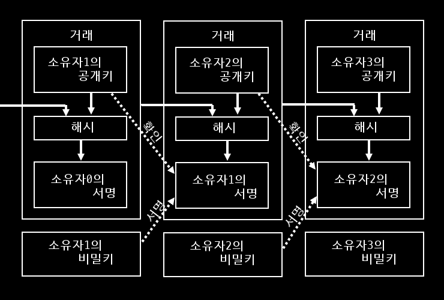
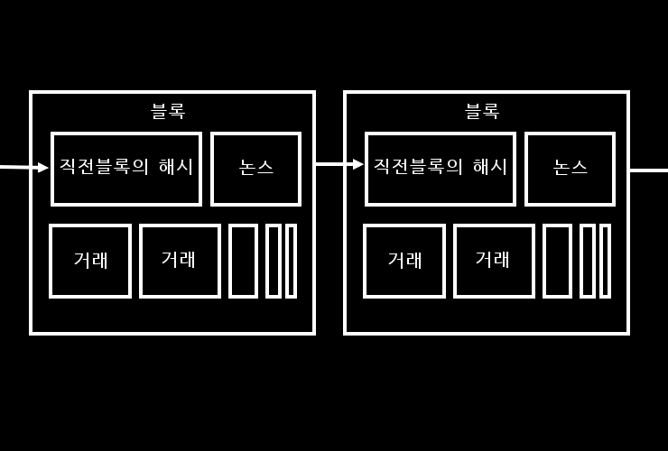
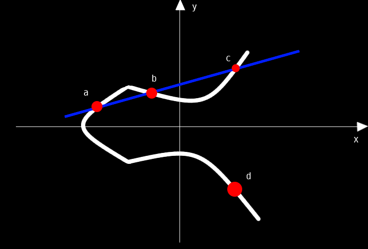

**이 글은 2015년 9월에 네이버 블로그에 작성한 내용을 옮겨온 것입니다.**

```toc

```


[가상통화 혁명: 비트코인은 시작에 불과하다](https://book.naver.com/bookdb/book_detail.nhn?bid=8769256)

## 비트코인의 시스템

### 전자서명으로 비트코인을 보낸다

비트코인은 P2P 네트워크를 통한 작업증명으로 블록체인을 유지함에 따라 운영되고 있다.

1. 전자서명을 사용해 비트코인을 보낸다.
2. 거래내역을 P2P네트워크로 유지되는 블록체인에 기록한다.
3. 블록체인의 내역 조작을 방지하기 위해 작업증명 계산을 한다.

하나의 전자코인은 연속되는 디지털 서명의 체인으로 정의된다.

코인의 소유권이 이전될 때 확인해야 하는 3가지

1. 송금한 사람이 틀림없이 서명자임.
2. 통신 도중에 금액 등이(방수자傍受者 등에게) 조작되지 않았음.
3. 송금한 사람은 송금 사실을 나중에 부인할 수 없음.



### 블록체인에 거래를 기록한다

전자적 수단의 문제점은 이중 사용

┗소유자1이 소유자2에게 송금해도 데이터는 남음.

기존 대책: “조폐국형”

┗사용된 화폐를 발행 주체에게 돌려주는 방식. 따라서 발행 주체가 새로 발행한 화폐만 사용할 수 있음.

비트코인: 거래 기록을 유지하고 공표함으로써 이중 사용을 방지

블록: 일정 기간의 거래기록. ‘정당한 거래’의 기록만이 허용.

★어느 시점에서 어떤 비트코인의 보유자는 단 한명만 존재한다. 비트코인은 특정 관리주체 없이 컴퓨터 집합체가 기록을 유지.

블록에 기재되는 내용

1. 과거 약 10분동안 전 세계에서 발생한 비트코인 거래(이것은 비트코인 송금자가 네트워크에 전송한 데이터)
2. 직전 블록의 해시(거래 정보의 요약)
3. 논스Nonce: 해당 블록의 해시 계산을 할 때 찾아내야 하는 어떤 수

블록체인

올바른 논스 값을 찾아낸 컴퓨터가 블록을 네트워크에 전송한다. 그러면 각 컴퓨터는 전송된 논스 값이 맞는지, 블록 내의 거래가 정당한 것인지 확인. 확인이 되면 그 블록은 승인되고 타임스탬프가 찍혀서 직전 블록의 뒤에 접속됨(10분단위 블록 생산→1년에 5만2560개 블록). 블록의 해시 값을 최초로 찾아낸 컴퓨터는 비트코인 형태로 보수를 받는다. 이 행위를 금의 채굴에 비교해 ‘채굴Mining’이라고 한다. 이렇게 해서 비트코인의 공급 총량은 서서히 증가한다. 17년까지 블록 1개 생성에 보수로 25BTC을 받는다 4년마다 보수가 절반으로 줄어들며 2140년까지 합계 2100만BTC가 생성되고 이후에는 새로운 비트코인이 공급되지 않는다. 채굴이 끝나도 블록은 계속 만들어짐. 채굴이 종료된 뒤에도 수수료 수입은 채굴자의 수입이 되므로 블록 유지 작업은 계속 될 수 있다.



### 비토코인의 중핵은 '작업 증명'

1. 각 컴퓨터는 새로운 블록의 승인에 앞서 계산 작업을 요구 받음(논스 값).
2. 정답을 찾기 위한 알고리즘이 존재하지 않아 일일이 대입해야 함(엄청난 작업이 필요).
3. 맨 처음 발견한 컴퓨터에서 P2P네트워크에 논스 값을 전송하고 다른 컴퓨터들에게 확인 받는다.
4. 확인 받으면 그 컴퓨터에 일정액의 비트코인이 주어지는 블록이 만들어지고 P2P네트워크에서 승인되며 타임스탬프가 찍혀 직전 블록의 뒤에 접속된다.

작업 증명(POW, Proof of Work)

: 위처럼 커다란 노력을 필요로 하는 작업을 부과하는 것.

블록체인의 기록의 조작

→거래 기록이 바뀌면 블록의 해시 값도 달라짐

→정상 블록으로 위장하려면 채굴 작업을 해서 조작한 내용에 대응하는 논스 값을 찾아야함. + 각 블록에는 직전 블록의 해시 값도 들어있기 때문에 그 블록의 바로 뒤에 이어지는 블록의 논스 값도 다시 계산해야 함.

조작을 위해서는 네트워크에 참가한 모든 정직한 채굴자의 계산력을 웃도는 컴퓨터 성능을 보유해야 함. 그러나 그 정도 성능의 컴퓨터라면 조작보다는 정직한 채굴자가 되는 것이 더 이익이 됨.

### '비잔티움 장군 문제'를 해결했다

비잔티움 장군 문제: 그룹의 일부에 배신자가 있을 때, 혹은 정보 전달을 신뢰할 수 없을 때 어떻게 해야 올바른 합의에 도달할 수 있는가?

⇒어려운 계산 문제를 부과

‘사람들이 손익을 합리적으로 계산한 결과로 전체 시스템의 유지에 협력한다’ ⇒ 성악설을 전제로 삼더라도 성립하는 사회구조

## 공개키 암호와 전자서명

### 모듈러 연산

- 두 개의 큰 소수(素數) Q와 R의 곱으로 N을 설정한다.
- X의 p제곱을 N으로 나눈 나머지를 Y라고 한다. X는 임의의 정수, p는 N보다 작은 임의의 정수(0<P<N)
- N을 고정하고 X와 P를 바꾸면 Y는 언뜻 불규칙한 패턴으로 변화하는 듯이 보임. 하지만 일정한 주기로 Y의 값이 원래의 X로 돌아옴.

### 디피-헬만 키 교환

두 명이 공통의 패스워드를 정하고자 할 때

1. N과 n이라는 두 정수를 결정. 이것을 서로 연락.
2. 각자가 비밀의 수 a를 정하고 ‘n을 a제곱한 다음 N으로 나눈 나머지 b를 구한다’는 계산을 한다. 그 결과인 b를 상대에게 전한다.
3. 각자가 상대의 답b와 자신의 비밀의 수a를 이용해 ‘b를 a제곱한 다음 N으로 나눈 나머지’를 구한다. 그러면 상대와 똑같은 결과가 나온다. 그 수를 패스워드로 삼으면 된다.

**전화가 도청되어 공통의 수 N, n과 상대의 답b가 알려지더라도 비밀의 수 a를 모르는 한 패스워드는 안전하다.**

### RSA암호

‘공개 키’는 공개, ‘비밀 키’는 작성자가 가지고 공개하지 않는다. 공개 키를 가지고 비밀 키를 계산하기는 (사실상)불가능하다.

예시>A가 B에게 암호문을 보내는 경우

: 이를 위해 메시지를 B의 공개 키로 암호화한다. 이 암호 메시지는 B의 비밀 키가 있어야 복호화할 수 있다.

1. 키 생성

   B는 두 개의 큰 소수 Q와 R을 선택하고 그 둘을 곱한 N을 구한다. 또 N보다 작은 수 p( Q-1, R-1과 서로소여야 한다.)를 선택한다. 그리고 N과 p(이 둘을 ‘공개 키’라고 한다.)를 이메일로 A에게 전달한다. N과 p는 다른 사람이 알아도 상관없다. 이어서 B는 ‘s와 p의 곱을 Q-1과 R-1의 최소공배수 u의 정수배로 나누면 나머지가 1이 된다’는 조건을 만족하는 수s를 구한다. 이 s는 비밀키로 불리며 절대로 다른 사람에게 알려지지 않도록 숨긴다.

2. 암호화

   A가 전하고 싶은 수를 x라 한다. A는 공개 키인 N과 p를 사용해 ‘x를 p제곱한 다음 N으로 나누었을 때의 나머지y’를 구한다. y가 x를 암호화한 것이다. A는 y를 B에게 보낸다.

3. 복호

   B는 비밀 키s와 A가 보낸 암호 메시지 y를 이용해 ‘y를 s제곱한 다음 N으로 나누었을 때의 나머지’를 구한다. 그러면 답은 반드시 원래의 수 x가 된다.

RSA암호는 계산량이 방대하므로 긴 메시지보다는 짧은 데이터를 공유화 할 때 이용됨. 또한 메시지 암호화보다는 ‘전자 서명’에 사용되는 일이 많음.

### 전자 서명

해시 함수가 요구하는 성질

① 같은 데이터에게는 같은 해시 값을 갖는다.

② 다른 데이터에게는 다른 해시 값을 갖는다.

③ 데이터를 요약해서 고정된 길이의 데이터로 변환한다.

④ 해시 값을 바탕으로 원래의 데이터를 추측할 수는 없다.

현재의 표준 해시 함수는 SHA256이다.

### 타원 곡선 암호화 ECDSA 서명

타원 곡선은 RSA암호보다 처리 속도가 빠름.



타원 곡선은 <math><mrow><msup><mi>y</mi><mn>2</mn></msup><mo>+</mo><msup><mi>x</mi><mn>2</mn></msup><mo>+</mo><msup><mi>ax</mi></msup><mo>+</mo><msup><mi>b</mi></msup></mrow></math>로 수식되는 곡선이다. 계수a, b를 정하면 곡선이 결정된다. 그리고 이 곡선 위에서 연산을 정의할 수 있다. 곡선 위의 점A, B의 합은 그림의 D로 표시된다. 여기서 D는 A와 B를 잇는 직선이 곡선과 교차하는 점 C의 y좌표의 부호를 반대로 한 것이다. A와 B가 똑같을 경우, 직선은 A의 접선이 된다. 이 경우에는 D는 A의 2배를 가리킨다. 이렇게 해서 K가 정수일 때 A의 K배를 정의할 수 있다.

**‘P의 K배를 Q라고 했을 때 K와 P가 주어진 상태에서 Q를 계산하기는 간단하지만, Q와 P가 주어진 상태(일 방향 함수, 타원 곡선 이산 로그 문제)에서 K를 계산하기는 매우 어려움’**

타원 곡선 엘가멜 암호

1. 비밀 키의 생성

   난수 S를 생성해 G의 S배인 T를 계산한다. T는 공개 키로 공개하고 S는 비밀 키로 보관한다. 공개 키T에서 S를 계산할 수는 없다. G는 곡선상의 기준점이다.

2. 공개 키를 이용해 암호문 작성

   난수 W를 생성해 G의 W를 계산. 이것을 C1으로 삼음. 또 공개 키 T의 W배를 계산. 이것과 메시지 M의 합을 C2로 삼는다. 암호문은 C1과 C2의 조합이다. 외부인은 W를 모르기 때문에 도청당하더라도 M으로 복호하지 못한다.

3. 비밀 키를 이용해 복호

   비밀 키S를 알고 있는 사람이 메시지를 복호하려면 C1의 S배를 계산하고 C2에서 이것을 뺀다. 이것을 M’로 삼는다. C1과 C2의 정의를 대입하면 M’가 M과 같음을 간단히 확인할 수 있다. 요컨대 이 조작을 통해 원래의 메시지를 얻을 수 있다.

‘외부인은 W를 모르지만, 비밀 키를 가진 사람은 W가 무엇이든 상관없이 원래의 메시지 M을 읽을 수 있다.’

타원 곡선을 이용한 ECDSA서명

1. 비밀 키를 이용해 서명 생성

   서명 생성은 기본적으로 비밀 키를 이용해 메시지의 해시 값을 암호화하는 것. 이를 위해 메시지 M의 해시 값 Hm, 난수 W, 비밀 키 S등으로 정의되는 어떤 식을 계산하고 그것을 서명으로 삼음.

2. 공개 키를 이용해 서명 검증

   메시지와 서명을 받은 사람은 먼저 수신 메시지의 해시 값을 계산. 이어서 서명, 수신 메시지의 해시 값, 서명자의 공개 키T 등으로 정의되는 어떤 식을 계산. 이 계산 결과 얻은 값이 서명과 일치한다면 서명을 수리한다. 즉 공개 키 T에 대응하는 비밀 키를 가진 사람이 이 서명을 했으며 메시지가 수정되지 않았음을 확인할 수 있다.
