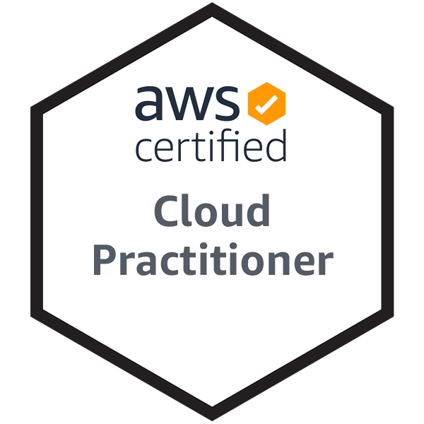

```toc
```

## 후기

필자가 2주 전에 Azure 자격증을 취득하여, 이번 취득과정에 대한 설명은 Azure 취득과정과 많이 비교하게 되었다. 참고하기 바란다.

### 시험 신청 및 준비

시험 신청은 PSI 혹은 Pearson Vue로 할 수 있었으나, PSI로 신청하였다. 왜냐하면 PSI 버튼이 Pearson Vue로 시험 신청하기 버튼보다 위에 있었기 때문이다. 나중에 이를 크게 후회하게 된다.

매월 진행되는 교육을 들으면 시험 할인 바우처를 주는 Azure와 달리, AWS는 기초 시험에 대해서 어떤 바우처도 제공하지 않는 것으로 확인하였다. 다만, AWS 기초 자격증을 획득하면 상위 자격증 시험 응시에 대해서 바우처를 제공하는 방식으로 되어있다. 그래서 110$(VAT 별도)를 지불하였다. 0$로 응시할 수 있었던 Azure 자격증 시험과 불합격에 대한 심리적 불안감이 많이 커지게 되었다.

Azure 자격증 시험을 원격으로 봐 본 이후, 원격 시험에 대한 자신감이 생겨 오프라인 시험장은 거들떠도 안보고 바로 원격 시험으로 골랐다. 시험 주관사와 관계없이 평일에는 많은 시간대에서 원하는 대로 골라서 볼 수 있다. 그에 비해 주말은 적은 편이다.

시험 변경은 2일 전에 신청해야 되는 것으로 알고 있다. Azure의 경우에는 1일 전에 가능하였으나, 이 규정이 AWS에서 되어있는 것인지, 시험 주관사마다 다른 것인지는 모르겠다.

### 준비 기간

6월 21일에 AWS Practitioner Level의 웨비나가 있다는 걸 알고, 3일 후인 6월 24일 오후 1시에 시험 신청을 하였다. 필자가 관심을 가지고 계속 Azure 제품군을 살폈던 것과 달리 AWS에는 눈길도 주지 않았기 때문에, 과연 3일 만에 합격할 수 있는가에 대해서 오만한 선택이 아닌가 생각했지만, 결국은 붙기는 했다. 6월 21일은 온라인 웨비나 시청하고 100 Level 실전 세션을 따라해보았고, 6월 22일은 Practitioner Essential 모듈을 학습 및 정리하였다. 6월 23일에는 실전 문제 더미들을 따라 풀면서 정리 및 복습하였다. 즉 3일 준비하였다.

### 준비 방법

첫 날에 온라인 세션으로 듣고 실전 세션을 따라한 것이 AWS에 대한 기본 개념을 잡는데 큰 도움이 되었다. 필자는 Azure와 AWS가 별 차이가 없을 줄 알았으나, 클라우드 세계를 개척한 선봉장답게, 좀 더 깊숙하고 원시적인 부분에서 많이 다르다. Azure Resource Group과 AWS Organization, AWS AZ와 Azure Availability set 등 기본적인 구성 블럭의 차이가 많이 발생한다. 가용성을 보장하는 부분에서도 많은 차이가 난다. Azure의 경우 구입하려는 제품의 **옵션**으로 LRS, ZRS가 제공되는 반면, AWS의 경우 스스로 여러 가용 집합에 제품을 **분배 설계**함으로써 내결함성을 구축해야한다.

둘째 날에는 [AWS Cloud Practitioner Essentials (Korean) 교육](https://www.aws.training/Details/eLearning?id=68459)을 공부하고 정리하였다. Azure Learn에 비해서는 분량은 더 적어서 좋다. 다만, 동영상을 시청한다면 더 많은 시간이 필요할 것이다. 조금 불편했던 점은 세션으로 유지되는 팝업창에서 교육이 진행된다는 것이다. 첫 날에는 넘겨들었던 내용도 이 과정을 통해서 상세히 살펴보고 갈 수 있었다. 특히나, 전체적으로 AWS 제품을 보지 못했던 나였기에 더 큰 도움이 되었다.

셋째 날에는 [Amazon AWS Certified Cloud Practitioner Exam Actual Questions | Examtopics (더미 문제)](https://www.examtopics.com/exams/amazon/aws-certified-cloud-practitioner/view/)를 직접 풀어보며 공부하였다. Azure의 경우 230문제 밖에 없어서 다 보고 공부할 수 있었으나, 역시 메이저 제품답게 문제도 600개 가량으로 많았다. 다 풀지는 못했고 400문제를 풀고 정리하였다. Azure와 마찬가지로, 둘째 날에 본 모듈만 보면 절대 붙을 수 없다는 것을 30문제 내에서 깨달았다. 특히나 더 어려운 것은 모듈에서 설명해 주지 않은 제품에 대해서 물어보는데, AWS 제품 이름은 하나같이 소설 이름처럼 되어있어서 머리 속에서 잘 매칭이 안된다는 점이다. Athena, Mecie, SageMaker 등 이름만 봐서는 절대 매칭이 안되는 것들이 있다. 특히 Config, OpsWork와 같이 필수 기능이면서 모듈에서 한번도 설명 안해준 기능을 자꾸 물어보는데 이것들은 더미로 틀려보지 않으면 알 수도 없는 항목들이다.

### 시험 준비

시험 시작 30분 전에 AWS 자격증 사이트로 들어가서 제공되는 링크를 통해서 PSI 소프트웨어를 실행하여 시험에 입장하였다.

이때부터 PSI와 Pearson Vue의 두드러지는 차이가 나타난다. PSI의 경우 컴퓨터 스피커를 활용하지 않는 것 같다. 모든 지시가 소프트웨어의 채팅창을 통해서 전달되었다. 웹캠을 통해 보더니 스피커를 치워달라고 한다. 모니터가 달려있지 않은 모니터 암도 치워달라고 한다. 핸드폰도 시험치는 책상에서 저 멀리 치워달라고 한다. 분명 시험관이 응답하지 않을 경우 국제전화를 거는 과정이 있는데도 불구하고 그렇게까지 치우면 어떻게 하라는 것인지 모르겠다. 그리고 몸 검사를 더 철저히 한다. 양쪽 귀가 비어있는가를 검사한다. 그리고 각 절차를 확인하는 응답이 늦다. 처음에 책상을 정리하는 과정에서 자꾸 치워달라고 해서 긴장되고 귀찮기도 했으나 다른 사람에 비해서는 덜 지적 받은 것 같다. 그래도 Azure 시험 볼 때 Pearson Vue를 통해서 봤는데 이때의 만족도가 더 높은 것 같다.

그리고 다시 한번 느꼈는데, 노트북이 있다면 노트북으로 시험을 보는 것이 가장 좋다. 왜냐하면 어떤 시험 주관사를 통해 보더라도 캠을 통해서 시험 보는 주변을 계속 보여줘야하는데, 웹캠의 경우 책상 밑을 보여주거나 주변을 보여주는 과정이 매우 힘들고 잘 못보여주기 때문에 감독관이 더 많은 지시를 내리고 시험자는 더 스트레스 받기 때문이다. 다행이도 앞으로 보고 싶은 시험이 없어서 다행이다. 이번 시험도 모니터를 하나로 제한하기 때문에 다시 모니터를 다 치웠기 때문이다.

모든 확인 절차를 거치더라도 Azure 시험과 달리 바로 시험 Phase로 이동하지 못했다. 시험 시작 시간인 1300이 되어야 시험 Phase로 이동할 수 있었다.

### 시험 진행

시험을 한국어로 신청했는데, Pearson Vue와 마찬가지로, 이해가 안가는 문장의 경우 영어로 확인한 후, 한글로 돌아와서 답안을 체크할 수 있는 기능이 있다. 근데 Azure 시험에 비해서 더 많은 문제가 한국어 번역이 매끄럽지 않은 것 같다. 그나마 다행인 점은 문제 은행식이라서 해당 문제의 영어 지문을 더미에서 봤던 것이랄까. 더미 문제에서 많이 출제되었다. 시험 전에 안 풀었다면, 시험 일정을 좀 더 뒤로 미뤄서라도 꼭 풀어보기를 바란다.

총 시험 90분에 70문제를 풀어야한다. 필자의 경우 25분에 다 풀고 따로 검토는 안하고 제출하였다.

시험을 다 보고 나면 바로 채점이 완료되어, 합불여부와 점수, 섹션별 점수를 확인할 수 있다. 필자는 1000 만점 기준 943점으로 합격하였다. 대략 3시간 후에 메일이 와서 합격 여부를 알려준다. 그때 부터 AWS 자격증 홈페이지에서 시험 점수와 섹션별 역량 충족 여부를 확인할 수 있다. Azure는 알려준다고 해놓고 아직도 섹션별 점수와 전체 점수를 어떻게 확인하는지 모르겠는데, 이부분은 AWS가 훨씬 낫다고 볼 수 있겠다.

### 시험 후기

어찌보면 벼락 치기로 취득한 자격증 같겠지만, 기본적인 클라우드 활용 경험과 전체적인 설계에 대한 직관이 없다면 힘들다고 생각한다. 그리고 그저 비슷비슷할거라고 생각한 클라우드 제품들이 제공사마다 다른 특징을 가지고 있다는 것을 알게 된 것도 큰 수확이라고 생각한다.

이로써 Azure와 AWS의 클라우드 기초 자격증을 확보하였다. 요즘 클라우드의 화두 중 하나는 멀티 클라우드를 통해서 클라우드 독립성을 확보하는 것인데, 이번 자격증 확보를 통해 얻은 여러 클라우드에 대한 지식으로 클라우드 독립성을 확보한 토이 프로젝트를 꼭 만들어보고 싶다.

### 합격 인증



## 실전 핵심 정리

아래 내용은 덤프 문제를 풀면서 정리한 내용이다. 필자 기준으로 작성이 된 내용이기는 하나, 틀리기 쉽거나 Practitioner Essential 교육에서 확인 할 수 없던 내용을 정리해놓았다.

| 중요도 | Fact                                                                                                                                                |
| --- | --------------------------------------------------------------------------------------------------------------------------------------------------- |
| V   | 운영 관점은 CAF 비즈니스 이해당사자의 요구 사항을 충족하도록 IT 워크로드를 운영 및 복구하는데 중점을 둔 관점                                                                                    |
| V   | 서비스 한도 및 사용률이 과도한 인스턴스에 대한 검사가 포함되는 AWS Trusted Advisor 범주는 비용 최적화<br><br>비용 최적화 범주에는 비용을 절감하기 위해 제거할 수 있는 사용되지 않는 리소스 또는 유휴 리소스에 대한 검사가 포함되어 있습니다. |
| V   | 1년 또는 3년 기간 동안 일정한 컴퓨팅 사용량을 약정하여 비용을 절감할 수 있는 컴퓨팅 옵션은 Saving Plans<br><br>예약 인스턴스는 Savings Plans과 달리 계약 기간 동안 일정량의 컴퓨팅 사용량을 약정할 필요가 없습니다.           |
| V   | 보안 그룹이 EC2에 대한 인/아웃 바운드 트래픽을 제어한다                                                                                                                   |
| V   | GuardDuty는 AWS 인프라 및 리소스에 대한 지능형 위협 탐지 기능을 제공하는 서비스 (로그 기반)<br>Amazon Inspector: 애플리케이션에서 보안 모범 사례 위반 및 보안 취약성을 검사하는 서비스                            |
| V   | 리전: 서로 격리된 여러 위치로 이루어진 개별적인 지리적 위치<br><br>가용 영역: AWS 글로벌 인프라의 완전히 격리된 파티션                                                                           |
|     | DocumentDB는 MongoDB 워크로드를 지원하는 문서 데이터베이스 서비스 (키값 아님)                                                                                                |
|     | Route 53은 AWS 내부 및 외부의 인프라에 사용자 요청을 연결, 도메인 이름의 DNS 레코드를 관리를 지원한다.                                                                                  |
|     | Amazon Augmented AI는 일반적인 기계 학습 사용 사례에 대한 인적 검토 워크플로를 기본 제공                                                                                         |
|     | 리플랫포밍: 핵심 아키텍처는 변경하지 않고 선택적으로 최적화하여 클라우드의 이점을 실현                                                                                                    |
| V   | AWS Config: AWS 계정과 연관된 리소스의 상세 보기를 제공, 리소스 인벤토리 및 변경 추적과 AWS 리소스 구성 평가에 도움<br>AWS OpsWorks: Chef 및 Puppet을 사용해 운영을 자동화                             |
| V   | Amazon SNS는 Amazon CloudWatch 경보를 기반으로 알림을 보낼 수 있음                                                                                                  |
|     | AWS Professional Services 팀이 지불받고 클라우드 도입을 도와준다                                                                                                     |
|     | 내부 aws 전문가가 없을 때에는 AWS Partner Network Consulting Partners 를 불러라                                                                                    |
| V   | EC2 Dedicated Host 에서는 가지고 있는 서버 라이선스를 활용할 수 있다                                                                                                     |
| V   | S3는 global service는 맞지만 File system은 아니다                                                                                                            |
| V   | 하이브리드 클라우드에 적용할 수 있는 서비스는 Route 53과 virtual private gateway 가상 프라이빗 게이트웨이 이다                                                                        |
|     | Self-host (customer-management) db의 경우에는 EC2에 EBS를 적용한다                                                                                             |
| V   | 비용 예측에 도움이 되는 것은, 비용 할당 태그와 가격 계산기와 총소유 계산기이다                                                                                                       |
| ?   | 조직 통합 비용에 장점은, 하나의 영수증으로 받아보는 것과, 볼륨 디스카운트를 받는 것이다                                                                                                  |
|     | 오래, 선불 비용 많이 내는게 예약 중에 가장 싸다                                                                                                                        |
| V   | 컨버티블 예약 인스턴스의 경우 더 높은 값으로 변경할 수 있다                                                                                                                  |
|     | 데이터 센터 1개 이상으로 구성 => 가용영역                                                                                                                           |
| V   | AWS와 고객 둘다 해야하는 것은 주의와 교육이다                                                                                                                         |
| V   | 고가용성을 달성하기 위한 가용영역 개수는 최소 2개이다                                                                                                                      |
|     | AWS CLI로 다른 서비스를 접근할 때는 Access key가 필요하다                                                                                                            |
|     | Global reach가 낮은 레이턴시를 제공하는 aws의 특징이다                                                                                                               |
|     | S3로 정적 사이트 업로드 하는게 가장 싸다                                                                                                                            |
|     | Spot - Up to 90% discount<br>Reserved - Up to 75% discount<br>On-demand – Full price<br>Dedicated hosts – Higher cost than on-demand                |
| V   | Elastic Cache와 RDS의 장점은, 쉽게 패치되고 업데이트 된다는 것이다<br><br>\> self host보다 더 나은 성능 X<br>\> 인스턴스 타입과 사이즈 선택 안해도 됨 X                                         |
|     | iam user는 cli쓸때 access key secret 키를 쓴다                                                                                                             |
|     | AWS는 Trust advisor security check와 data encryption을 통해 보안 관련 기능을 제공한다                                                                               |
|     | AWS와 고객 모두 다른 수준에서 패치 관리를 해야한다                                                                                                                      |
| V   | VPG 로 접근할 때 aws vpn 제품을 쓸 수 있다                                                                                                                      |
| V   | AWS 리소스에 대한 aws event는 Personal Healthboard에서 찾을 수 있다(Service 아님)                                                                                   |
| V   | . Updating Amazon EC2 host firmware 는 AWS의 책임이다                                                                                                     |
| V   | B. AWS OpsWorks C. AWS CodeDeploy를 통해서 onpremise에 배포 작업을 수행할 수 있다                                                                                   |
| V   | 스팟 인스턴스의 가격은 EC2 수급 상황에 따라 변동된다.                                                                                                                    |
| V   | 서포트 플랜에 따른 응답 최대 기간<br><br>Enterprise: As little as 15 mins<br>Business: As little as 1 hour<br>Developer: As little as 12 hours                    |
| V   | 침투 테스트 할 때 고객은 고객 내부 보안팀의 허가를 받고 시행해야한다                                                                                                             |
| V   | aws 글로벌 서비스는 Route 53과 CloudFront 이다. (S3는 리전 있다)                                                                                                   |
| V   | AWS를 쓰면 실질적으로 reduced operational expenditure (opex). 한다                                                                                            |
| V   | 비용및 사용 보고서를 쓰면 most granular data를 파악할 수 있다                                                                                                         |
| V   | CloudTrail 자체는 보안 향상에 도움이 되지는 않는다. MFA와 최소권한 부여가 도움이 됨                                                                                              |
| ?   | AWS Storage gateway는 온프레미스 앱이 클라우드 파일시스템을 사용하는 데 도움이 된다                                                                                             |
| V   | RDS의 Scale Up은 사용자에의해 수동으로 작동된다                                                                                                                     |
| V   | 아마존 규모의 경제에 따라 주기적으로 가격이 낮아진다                                                                                                                       |
| V   | Cloudwatch는 query를 90일 동안 가지고 있는다.<br><br>CloudHSM은 AWS 클라우드상의 관리형 하드웨어 보안 모듈(HSM).이다                                                               |
| V   | 인프라스트력쳐 이벤트 관리는 가장 상위인 Enterprise support에서 지원한다                                                                                                    |
| V   | Business Support 부터 전화걸수 있다 (연중 무휴 247)                                                                                                             |
| ?   | 정말 급하게 IT솔루션을 배포해야할 땐 QuickStart reference deployment 를 보자                                                                                          |
|     | SNS도 서버리스다                                                                                                                                          |
|     | SSO 설정은 Directory 서비스에서 한다<br><br>amazon connectㅣ콜센터<br>pinpoint | 커뮤니케이팅 마케팅 서비스<br>rekognition | 비디오 이미지 기계학습                                     |
| V   | 프라이빗 클라우드에 비해 AWS는 Configuration Management Db를 제공함으로 편의성을 제공한다                                                                                     |
|     | aws x-ray는 프로덕션 분산 앱의 분석 및 디버깅 툴이다                                                                                                                  |
| V   | VPC간의 연결은 VPC peering 기능을 사용하면 된다                                                                                                                   |
| V   | ELB elastic load balancer는 1)application load balancer와 classic load balancer를 지원한다                                                                 |
| V   | ddos를 막는 aws shield는 standard에서 WAF와 Cloudfront를 지원하나, advanced로 업글해야만 EC2를 지원한다                                                                    |
| V   | AWS TCO 가격은 AWS의 데이터 센터 보안 기능이 포함되어있다                                                                                                               |
| V   | 제한된 포트 목록에 제한 없이 인터넷 액세스를 허용하는 보안 그룹을 식별하는 AWS 도구 => Trust Advisor => 만약 그런게 있다면 감지함                                                                |
| V   | EC2 Auto Scaling groups는 Multiple 가용범위 안에서 scaling out된다                                                                                            |
|     | EC2는 초단위 계산한다                                                                                                                                       |
| V   | 엣지로케이션을 사용하는 프로덕트는 CloudFront와 Shield가 있다                                                                                                           |
| V   | Ddos공격을 받았을 때에는 Trust & Safety Team에 먼저 연락하자                                                                                                        |
| V   | cloudtrail은 실시간 모니터링과 로그에 대한 유지 기간을 설정가능하다                                                                                                          |
| ?   | 침투 테스트는 AWS가 자동으로 제공하지 않음                                                                                                                           |
| V   | AWS Elastic Beanstalk 는 앱의 배포 자동화 로드 밸런싱 scaling up 자동화 및 헬스 모니터링을 제공한다                                                                             |
| V   | AWS Macie는 데이터 기반 보안 분석 .security service that uses machine learning to automatically discover, classify, and protect sensitive data in AWS         |
| ?   | EBS에 대한 encryption을 제공하는 것은 AWS KMS이다                                                                                                               |