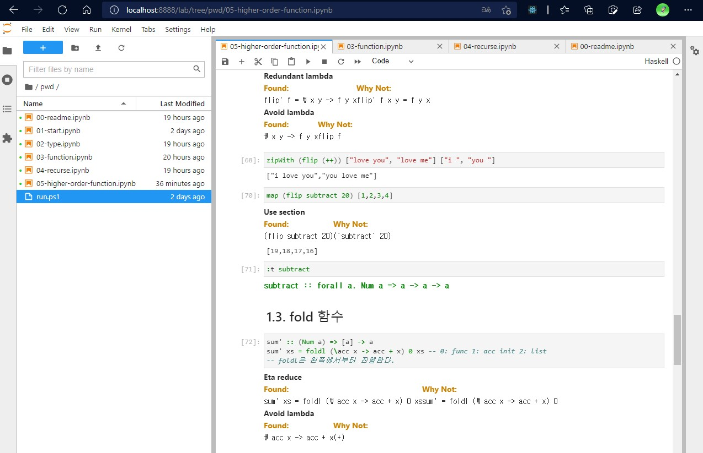

[docker hub | crosscompass/ihaskell-notebook](https://hub.docker.com/r/crosscompass/ihaskell-notebook)

위 도커 이미지를 활용하여 웹브라우저에서 쉽게 Haskell 노트북을 작성할 수 있다.



도커 볼륨과 연결할 디렉토리로 이동한 다음 명령어를 입력하자

```bash
docker run --rm -p 8888:8888 -v $PWD:/home/jovyan/pwd --name ihaskell_notebook crosscompass/ihaskell-notebook:latest jupyter lab --LabApp.token=''
```

윈도우의 경우에는 아래를 입력하자

```powershell
docker run --rm -d -p 8888:8888 -v ${PWD}:/home/jovyan/pwd --name ihaskell_notebook crosscompass/ihaskell-notebook:latest jupyter lab --LabApp.token=''
```

윈도우에서 WSL2 기반 도커를 사용할 경우, 이미지를 중단했다가 resume 할 때 에러가 나는 경우가 있는데, 이때는 도커 데스크톱을 종료한 후 켜보도록 하자. 잘 될 것이다.
