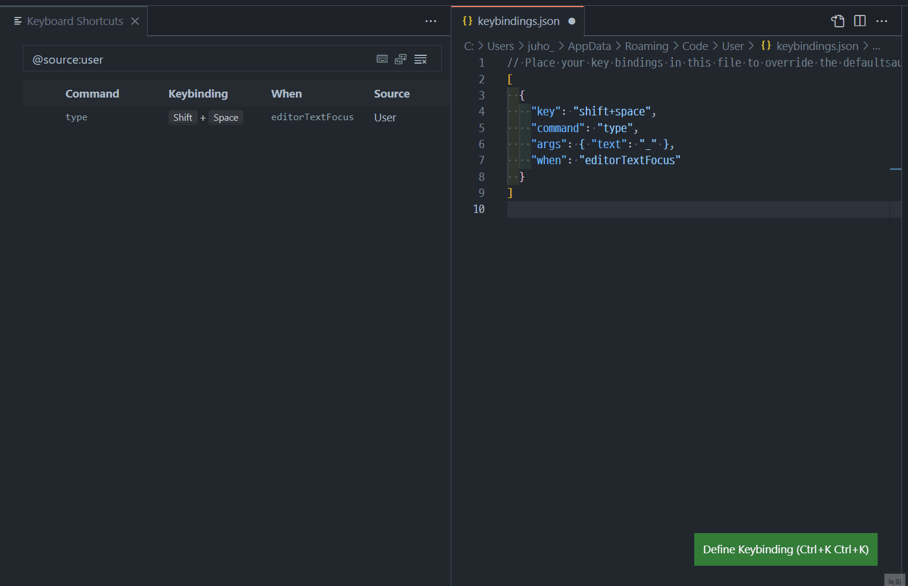

필자는 최근 [Rust](https://www.rust-lang.org/)를 배우고 있는데, 러스트의 변수와 함수명은 [snake_case](https://en.wikipedia.org/wiki/Snake_case)를 사용한다.

```rust
fn main() {
    println!("guess number");
    let secret_number = rand::thread_rng().gen_range(1, 101);
    // println!("맞춰야할 숫자 {}", secret_number);
    loop {
        println!("answer!");
        let mut guess = String::new();
        io::stdin()
            .read_line(&mut guess)
            .expect("입력한 값을 읽지 못했습니다.");
        let guess: u32 = match guess.trim().parse() {
                Ok(num) => num,
                Err(_) => continue,
            };
        println!("입력한 값: {}", guess);
        match guess.cmp(&secret_number) {
            Ordering::Less => println!("less"),
            Ordering::Greater => println!("greater"),
            Ordering::Equal => {
                println!("equal");
                break;
            },
        }
    }
}
```

왼손 새끼손가락이 너무 아프다. `_`는 <kbd>shift</kbd> + <kbd>-</kbd>를 눌러야 입력되는 것인데, 너무 많이 눌러야하는 것이다! 무슨 방법이 없나 싶다가, 방법들이 잘 안 찾아지니까 Rust 만든 놈은 손가락이 교체가 되나 싶기도 했다.

하지만 너무 단순한 답이었던 것일까. 3일 정도 고통받으며 생각한 답은 VSCode에 사용자 단축어를 지정하는 것이었다.

먼저 Keyboard Shortcuts에 들어가자. 그 후 탭바 오른쪽에 있는 문서 아이콘을 누르면 JSON으로 나타나게 되는데 아래와 같이 입력하면 된다. 내용은 짐작가겠지만, 에디터 환경 일 때 <kbd>shift</kbd> + <kbd>space</kbd>를 누르면 `_`를 작성하게 하는 단축어이다! 다행이도 예약되지 않은 키조합이었다.



개발자에게 문제를 해결할 수 있는 능력보다 소중한 것은 코드를 볼 수 있는 눈과 코드를 칠 수 있는 손이 아닐까? 다시 자라나지 않는 기관인만큼 아끼고 사랑하도록 하자.
