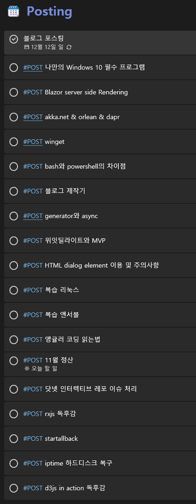

```toc

```

## 변명

우선 10월과 11월에 무슨 일이 있어 포스팅을 하지 않았는지에 대한 변명으로 시작하겠다.

### 기계적인 포스팅에 대한 피로

마지막 포스트가 `vagrant`에 대한 가이드로, k8s 교육 과정에 대한 정리 포스트였다. 이 이후로 `linux`와 `ansible`에 대한 정리도 들어가야하는데 사실 그 양이 굉장히 많았고, 내용도 어려웠다. 게다가, 내가 정말 쓰고 싶어서 쓰는 글이라기 보다는 "내가 이 교육과정을 수강하고 있습니다~ 진짜에요~ 믿어주세요~" 하는 호소에 가까운 글이라서 의무감으로 쓰고 있었다. (결국 지금까지 안 썼다.) 그리고 이 블로그 자체도 험난한 취업시장 속에 살아남기 위해 기술 블로그라는 사다리를 기어코 올라간 것이라고 볼 수 있다. 결국 취업을 하고나니 주기적으로 포스팅을 해야한다는 의무감이 1달간 시원하게 사라져버린 것이다.

### 미래에 대한 불안함

현재 이용하는 전세의 연장과 이사에 대한 결정, 고정비용에 대한 부담, 부모님의 기대, 취업 가능성 등 여러가지 상황이 복합적으로 얽히기 시작하니, 할 공부나 하다가 자신있게 원하는 기술로 취업하겠다는 퇴사 당시의 포부가 굉장히 약해졌다. 이런 스트레스로 인해 어떤 일을 해도 '내가 목표를 향하고 있는 것이 맞나? 남들만큼 속도는 나오고 있나?' 이런 생각이 들면서 무기력해지는 것이었다. 그 무기력함을 핑계대면서 '포스팅 못하는 기분이야 어쩔 수 없어' 이러면서 포스팅을 안했다.

그렇다고 손 놓고 파국으로 치닫을 수는 없는 노릇이 아닌가. 상황을 해결하는 가장 첫번째 단계가 취업이라는 것이 명확하고 효과적인 수단이었기 때문에, 10월 즈음부터 이력서를 준비하고 각종 구직 사이트에 게시를 하기 시작했다.

### 헤드헌터의 제안

그렇게 잡플래닛, 로켓펀치 등 구직 사이트에 게시를 해놓으니, 회사보다는 헤드헌터에서 더 연락이 왔었다. (2021-11 현 상황에서 가장 활발한 구직 사이트는 원티드인 듯하다. 여기부터 이력서를 채우는 것을 추천한다.) 그러다가 헤드헌터를 통해 좋은 회사에서 제안을 받아 이력서를 제출하고 원격 면접을 보았다. 간단한 코딩 문제가 있을 거라고 했는데, 코딩 문제만 있었다. 알고리즘을 즐겨 접하지 않는 사람으로써 굉장히 당혹스럽고 민망한 실력을 보여주었고, 결국 떨어졌다.

하지만, 그 면접을 보기 전에 비교군으로써(필자가 김치국을 심하게 마시는 스타일인듯하다.) 여러 회사에 지원하고 면접을 보았고, 물론 첫번째 면접의 불합격 결과가 먼저 나왔지만 다른 회사에 붙게 된 것이다.

### 취업

2021년 11월, 어찌저찌 세상 살아갈만큼의 운은 주어진 것인지 결국 취업을 하게 되었다. 취업을 했으니 무엇을 먼저 해야겠는가? 당연히 놀아야하는 것이다. 안 본 영화도 못 본 영화가 되고, 안 간 부모님 댁도 지금껏 못 간 것이 되고, 하여간 여러 일정이 생겼다. 내가 나에게 주는 선물. 사람은 언제든 핑계대는 것을 잘한다. 그리고 취업을 하고나니 회사 분위기 파악도 해야하고, 닥눈삼은 아니지만 한달은 회사 적응을 위해 시간을 비워놔야하는 것 아니겠는가. 결국, 이렇게 저렇게 도합 1달을 또 포스팅을 하지 않은 것이다.

## 앞으로

취업을 하고 다시 한번 코드 앞에 앉아보니, 기발한 포스팅 주제들이 막 떠오르기 시작한다. 게다가 취직한 직장의 핵심 가치가 알고리즘이고, 시니어 분이 최신 지식과 트렌드 공유에 호응을 해주셔서 회사 내에서도 새로 접하고 배우는 것이 많다. (물론 내가 지금 접한 코드는 여기저기 손볼 곳 투성이지만... 😒) 그렇게 프론트엔드 개발자로 뽑혀온 나지만 C# 패턴 매칭 스터디도 발표자료를 만들어 세미나를 진행했다. 회의에서 액터 모델을 제시하자 나보고 공부해오라고 한다!

그렇다! 의무감이 아니라 내가 쓰고 싶어서 쓸 주제들이 지금 쌓여있고, 쌓아가는 중이다!



주제가 많지만, 앞으로 1주에 1개씩은 어렵겠지만 1달에 1개씩을 꼭 올려고 생각하고 있다. 남들에게 보여줄만한 가치있는 글을 쓰고 싶은것이지, 블로그를 TIL, WIL 같은 인생 로그로 채우려는 것이 아니기 때문이다.

다시 한번, 앞으로 더 좋은 내용의 포스팅으로 블로그 방문객들을 맞이하도록 하겠다. 그럼 이만~🎊